# claw-bell — Architecture

How a Claude Code session running on a headless Linux server makes the chime
come out of the speakers on your Mac.

## The problem

`hooks/notify-sound.sh` plays audio locally. Over SSH there is no local audio
device, so the script detects `$SSH_CONNECTION` and degrades to a terminal
bell:

```bash
if [ -n "$SSH_CONNECTION" ] && [ "$PLAT" != "wsl" ]; then
    printf '\a'
    exit 0
fi
```

One fixed beep, no theme, no voice, and it depends on the terminal app's bell
settings. Sessions on `s1` and `s2` are indistinguishable from each other.

## The approach

Audio stays on the Mac. The server sends an *intent* — "a session here wants
input" — over the SSH connection that is already open, and the Mac decides what
to play. No audio crosses the wire, no inbound firewall hole, no extra keys.

```mermaid
flowchart LR
    subgraph S1["s1 &mdash; Linux server"]
        C1["Claude Code session"] --> H1["notify-sound.sh"]
        H1 -->|"stop&#124;dnd&#124;s1"| P1(["127.0.0.1:8127"])
    end

    subgraph S2["s2 &mdash; Linux server"]
        C2["Claude Code session"] --> H2["notify-sound.sh"]
        H2 -->|"notification&#124;classical&#124;s2"| P2(["127.0.0.1:8127"])
    end

    subgraph MAC["MacBook"]
        L["chime-listener.py<br/>127.0.0.1:8127"]
        L --> V{"validate"}
        V -->|"reject"| X["log &amp; drop"]
        V -->|"ok"| PR{"at the Mac?"}
        PR -->|"yes"| A["afplay melody<br/>afplay speech"]
        PR -->|"no"| Q["skip local"]
        V -->|"ok"| BC["broadcaster"]
        BC --> WEB["chime_web.py<br/>SSE :8128"]
        A --> SPK(["🔊"])
        C3["Local Claude session"] --> H3["notify-sound.sh"] --> A
    end

    WEB -.->|"SSE over VPN"| PHONE["phone browser<br/>🔊 when away"]

    P1 -.->|"ssh -R tunnel"| L
    P2 -.->|"ssh -R tunnel"| L
```



The dotted lines are `RemoteForward 8127 127.0.0.1:8127` in `~/.ssh/config`.
Each server gets a loopback port that tunnels back to the Mac's listener.

## Components

### `hooks/notify-sound.sh` (all hosts)

Unchanged on the Mac. The SSH branch gains one step before the bell fallback:

1. Global mute, per-TTY mute, sub-agent and plan-mode filtering — all run
   *before* this point, so `/mute` keeps working on remote sessions.
2. Open `/dev/tcp/127.0.0.1/$CHIME_PORT`. This is a bash builtin, so the
   servers need no `nc`, no python, no new package.
3. Write one line: `event|theme|label`.
4. If the connect fails — no tunnel up, listener down — fall back to
   `printf '\a'`, exactly today's behaviour.

### `hooks/chime-listener.py` (Mac only)

A `ThreadingTCPServer` bound to `127.0.0.1` — loopback only, so nothing off the
machine can reach it; the SSH tunnel is the only path in.

Every field is validated before it touches the filesystem:

| Field   | Rule                                                        |
|---------|-------------------------------------------------------------|
| `event` | must be `stop` or `notification`                             |
| `theme` | must match a directory that actually exists under `sounds/`  |
| `label` | `[A-Za-z0-9._-]` only                                        |

`theme` is whitelisted against a real directory listing rather than sanitised,
so `../../etc` cannot escape the sounds tree. Playback is serialized behind a
lock — two servers chiming at once queue rather than talk over each other.
Activity goes to `~/Library/Logs/claw-bell.log`.

Kept running by `~/Library/LaunchAgents/com.claw-bell.listener.plist`
(`RunAtLoad` + `KeepAlive`).

## Telling the machines apart

Each host gets its own theme from the ten already in the repo, so you know who
wants you without looking at the screen:

| Host | Theme       |
|------|-------------|
| Mac  | `videogame` |
| s1   | `dnd`       |
| s2   | `classical` |

`config.json` is tracked in git, so editing it per host would be undone by the
next `claude plugin update`. The hook therefore reads an optional
`~/.claude/claw-bell.json` whose keys override the plugin's `config.json`. That
file lives outside the plugin directory and survives updates.

## Triggers

Both hooks already declared in `hooks/hooks.json` forward over the tunnel:

- **`Stop`** — the agent finished and is waiting on you.
- **`Notification`** — a permission prompt or elicitation dialog is blocking.

## Message format

```
event|theme|label\n
```

Newline-terminated, one per connection, ASCII. Example: `stop|dnd|s1`.

Deliberately not JSON — the sender is a bash builtin redirect, and the receiver
should parse as little as possible.

## Failure modes

| Failure | Behaviour |
|---------|-----------|
| Listener not running | Connect fails, remote falls back to terminal bell |
| No `RemoteForward` (raw `ssh` to an IP) | Same — terminal bell |
| Mac asleep | Connect fails, terminal bell |
| Second SSH session to the same server | Cannot re-bind port 8127 there; ssh warns and continues, and the first session's tunnel still serves every session on that host |
| Malformed or hostile line | Rejected by validation, logged, dropped |
| Presence probe fails | Returns "at the Mac", so it plays locally — the behaviour from before presence existed |
| Away, but no browser connected | Plays locally anyway; a chime handed to nobody is lost, which is worse than playing to an empty room |
| Web server disabled or crashed | TCP path and local playback unaffected |
| No phone connected | Event is broadcast to nobody; the Mac is unaffected |
| Phone tab not armed | Silent, and the page says so |
| Phone out of range, slow, or asleep | Its bounded queue drops events; local playback never stalls |
| Heartbeat missed | Page turns amber rather than looking healthy |
| Phone reconnects after sleep | Rejoins a live stream; `Last-Event-ID` is ignored so no stale burst fires |

Every failure degrades to exactly the behaviour that exists today. Nothing
gets worse than a beep.

## Install

Same two commands on all three machines:

```bash
claude plugin marketplace add chandroos24/claw-bell
claude plugin install bells-and-whistles
```

`.claude-plugin/marketplace.json` exists to make this work; before it, the repo
carried only `plugin.json` and was not installable as a marketplace.
