# Presence-routed chime delivery

**Status:** proposed
**Date:** 2026-09-17
**Supersedes nothing.** Extends the SSH chime forwarding described in
[docs/architecture.md](../../architecture.md).

## Goal

A chime should come out of whichever device you are actually near. At the Mac,
the Mac plays it. Away from the Mac and moving around the house, the phone
plays it. Both, when you want both.

Today the Mac is the only sink, and it plays whether or not you are sitting at
it.

## Non-goals

- Chiming a locked or pocketed phone. Browsers suspend audio in backgrounded
  tabs. An Android-only keepalive (below) stretches this, but a locked phone
  reliably alerting is a push-notification problem, not a web-audio one, and is
  out of scope.
- Any device outside the WireGuard network.
- Replacing `afplay`. The local path stays exactly as it is.

## Findings that shaped this design

These were established by investigation, not assumption, and each one changed
the design:

1. **Tailscale is the wrong transport here.** Android permits exactly one VPN
   at a time, and WireGuard already occupies that slot on the S24. Tailscale
   and WireGuard cannot both run. Using the existing WireGuard network removes
   this conflict, and with it the MagicDNS dependency and the
   cert-cannot-be-issued-for-an-IP problem.

2. **The Mac is already routable on WireGuard** at `10.66.66.2` (interface
   `utun6`, network `10.66.66.0/24`, hub `10.66.66.1` = s1). Verified
   reachable from s1 at ~30 ms.

3. **`http://10.66.66.2:8128` is not a secure context.** Only `localhost` gets
   that treatment; private IPs do not. This costs Service Worker, Web Push and
   Screen Wake Lock. It does *not* cost Web Audio or MediaSession, so the
   Android keepalive still works. See "Future: HTTPS" if that changes.

4. **macOS presence is readable without root**, from a launchd GUI agent:
   `ioreg -c IOHIDSystem` yields `HIDIdleTime`, and the
   `CGSSessionScreenIsLocked` key is absent when unlocked.

## Architecture

```mermaid
flowchart TD
    S1["s1 session"] -->|"stop&#124;dnd&#124;s1"| L
    S2["s2 session"] -->|"notification&#124;classical&#124;s2"| L

    subgraph MAC["Mac &mdash; 10.66.66.2"]
        L["chime-listener.py<br/>127.0.0.1:8127"]
        P["presence probe<br/>idle + lock"]
        L --> P
        P --> D{"mac_active?"}
        D -->|"yes"| A["afplay 🔊"]
        D -->|"no"| Q["skip local"]
        L --> B["broadcaster"]
        B --> W["chime_web.py<br/>10.66.66.2:8128"]
    end

    W -->|"SSE over WireGuard"| PH["Android Chrome<br/>Samsung S24"]
    PH --> T{"toggle"}
    T -->|"Always"| PL["play 🔊"]
    T -->|"Away &amp; !mac_active"| PL
    T -->|"Off"| SI["silent"]
```



## Components

Three units, each independently testable.

### `hooks/chime-listener.py` (existing, extended)

Keeps owning the TCP protocol and playback. Gains exactly two things: a
presence check gating the local `afplay`, and a call publishing the chime to a
broadcaster. It does not learn about HTTP.

### `hooks/presence.py` (new)

One function, `mac_active(idle_threshold)`, returning a bool. Shells out to
`ioreg` twice and to `stat -f%Su /dev/console`. Results cached for 2 seconds so
a burst of chimes does not spawn a burst of subprocesses.

`mac_active` is true when **all** of:

- a console user is logged in (`stat -f%Su /dev/console` is not `root` or empty)
- the screen is not locked (`CGSSessionScreenIsLocked` key absent or false)
- `HIDIdleTime` is below `idle_threshold` (default 300 s)

On any error — `ioreg` missing, unparseable output, non-macOS — it returns
`True`. Failing toward "play locally" preserves today's behaviour rather than
silently going quiet.

### `hooks/chime_web.py` (new)

An HTTP server that knows nothing about TCP or playback. Three routes:

| Route | Purpose |
|---|---|
| `GET /` | the page |
| `GET /events` | SSE stream |
| `GET /sounds/<theme>/<file>.wav` | the audio |

`/sounds/` reuses `list_themes()` and the same whitelist rule as the wire
protocol, so the traversal rejection already under test covers the HTTP surface
too.

### `web/index.html` (new)

One self-contained page: an arm button, a three-way toggle, a live event list,
and a staleness indicator.

## Routing policy

The server computes presence once and stamps it on every event. Each sink then
applies its own rule. The phone's preference lives in `localStorage`, so it
survives a listener restart and needs no control endpoint.

| Phone toggle | `mac_active` | Mac plays | Phone plays |
|---|---|---|---|
| Always | true | yes | yes |
| Always | false | no | yes |
| Away | true | yes | no |
| Away | false | no | **yes** |
| Off | true | yes | no |
| Off | false | no | no |

The last row loses the chime deliberately: you are away from the Mac and have
switched the phone off. It is logged so the log explains the silence.

## Wire format

SSE `data:` payload, one JSON object per event:

```json
{
  "id": 17,
  "ts": "2026-09-17T14:15:12Z",
  "event": "stop",
  "theme": "dnd",
  "label": "s1",
  "melody": "/sounds/dnd/long_rest.wav",
  "speech": "/sounds/speech/us/male/stop_0.wav",
  "mac_active": true
}
```

The server names the exact files it chose, so the phone plays the same sound
the Mac would have — `long_rest.wav`, not a generic beep.

A heartbeat comment (`: hb`) every 20 s keeps intermediaries from idling the
connection out and drives the staleness indicator.

**No replay.** The server ignores `Last-Event-ID`. A phone waking from Doze
reconnects to a live stream and hears nothing stale. Without this, waking the
phone fires a burst of old chimes.

## The page

- **Arm button.** Browsers block audio until a user gesture. One tap creates
  and resumes the `AudioContext`. Until tapped, the page shows "tap to enable
  sound" rather than pretending it is working.
- **Toggle**: Always / When away from Mac / Off, persisted in `localStorage`.
- **Event list**: last 50, showing host, event, theme and local time.
- **Staleness indicator**: green when a heartbeat arrived within 30 s, amber
  when one is missed, red on `EventSource` error. This is the highest-value
  element on the page — nearly every Android failure mode presents as "looks
  connected, delivers nothing", and this makes that visible.
- **Ducking**: chimes play over other audio rather than suppressing themselves.
- **Android keepalive (opt-in toggle)**: a silent looping `<audio>` plus a
  MediaSession keeps the tab alive and audible with the screen off on Android.
  Off by default — it costs a persistent media notification and battery. iOS
  ignores it.
- Preloads and caches each theme's WAVs after arming, so a chime does not wait
  on a fetch across the tunnel.

## Security model

- `chime_web.py` binds one configured address, never `0.0.0.0`. Default
  `127.0.0.1`; set to `10.66.66.2` to reach the phone. Binding the WireGuard
  address specifically means the LAN cannot reach it even when the tunnel is up.
- WireGuard membership **is** the authentication. There is no login.
- The endpoint exposes which hosts chimed and when, which leaks when you are at
  your desk. Low sensitivity, non-zero, and confined to the wg network.
- `/sounds/` serves only files under `sounds/`, whitelisted by directory
  listing.
- No write endpoints. The page cannot mute, configure, or trigger anything.

## Configuration

New keys, all in `~/.claude/claw-bell.json` or the plugin's `config.json`:

| Key | Default | Meaning |
|---|---|---|
| `web_enabled` | `false` | start the HTTP server at all |
| `web_bind` | `127.0.0.1` | address to bind; `10.66.66.2` to reach the phone |
| `web_port` | `8128` | HTTP port |
| `presence_enabled` | `false` | gate local playback on presence |
| `idle_threshold` | `300` | seconds of HID idle before "away" |

Everything defaults off, so an existing install that updates gains no new
listening socket and no behaviour change.

## Failure modes

| Failure | Behaviour |
|---|---|
| Web server disabled or crashed | TCP chime path and `afplay` unaffected |
| No phone connected | Event broadcast to nobody; Mac unaffected |
| Phone tab not armed | Silent, and the page says so |
| Heartbeat missed | Indicator turns amber |
| `EventSource` drops | Auto-reconnects; no replay, so nothing stale fires |
| Presence probe fails | Returns `True`, Mac plays — today's behaviour |
| Slow phone client | Bounded per-client queue drops events; `afplay` never stalls |
| **Phone `AllowedIPs` excludes 10.66.66.2** | Phone cannot reach the Mac at all. Not detectable from the Mac; see Open Questions |
| **Android VPN slot taken** | Resolved by using WireGuard, which already holds it |
| **Samsung sleeping-apps eviction** | Tab or tunnel killed; surfaces as amber/red indicator |
| **Android Doze** | Connection drops; reconnects on wake, no stale burst |
| Chrome discards the tab | Reloads unarmed; page shows "tap to enable" |

## Testing

**Unit** — presence parsing against captured `ioreg` fixtures for locked,
unlocked, idle and logged-out states, including the fail-open path; the routing
truth table as six explicit cases; SSE frame encoding; `/sounds/` traversal
rejection.

**Integration** — a real listener plus a real SSE client: send a TCP chime,
assert the client receives the right theme, label and `mac_active`; assert a
second client also receives it; assert a disconnected client is cleaned up;
assert `Last-Event-ID` produces no replay.

**Manual** — arm the page on the S24 over WireGuard, chime from s1, confirm the
themed WAV plays; lock the Mac and confirm routing flips; confirm the amber
indicator appears when the listener is stopped.

## Future: HTTPS

If Web Push, Service Worker or Wake Lock become desirable, the clean path is a
DNS-01 Let's Encrypt certificate for a name like `claw.dharmaposhanam.in` with
a public A record pointing at `10.66.66.2`. Public DNS pointing at a private
address is ordinary and costs nothing. That upgrade is additive and does not
change anything above.

## Open questions

1. **Does the phone's WireGuard `AllowedIPs` include `10.66.66.0/24`, or only
   the hub?** If only the hub, the phone cannot reach the Mac and nothing works
   until it is widened. s1's WireGuard config requires root, so this could not
   be verified from here — check the tunnel in the WireGuard Android app.
2. Should the Mac also stop chiming when *muted* via the existing `/mute`, or
   is presence gating independent of it? Current assumption: independent, both
   apply, mute wins.
3. Is 300 s the right idle threshold, or does it feel too slow to hand over to
   the phone?
